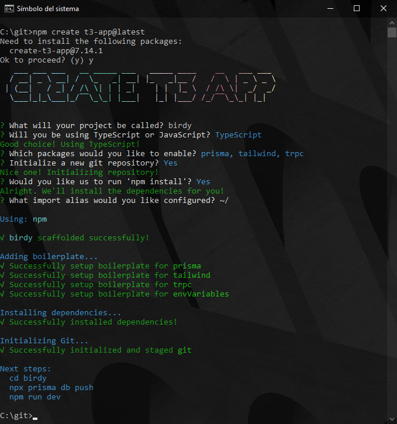

The T3 stack is a web development stack proposed by Theo Browne. It is a popular choice to build large scale web applications simply and quickly, taking care of bussiness logic, database handling, object validation, API schemas, authentication and UI styling. 

This tutorial will guide you through the development of a Twitter clone using the T3 stack. We will cover all the steps from the installation of the tools that comprise the T3 stack, hosting the code on GitHub, setting up a database and deploying our app to the cloud!

## The tools in the T3 Stack
Let's start by presenting the tools that comprise the T3 stack, these are:

1. [NextJS](https://create.t3.gg) A React framework supporting server side rendering, file based routing and asset optimization.
1. [Typescript](https://www.typescriptlang.org) A superset of JavaScript with support for static typing that safely compiles into JavaScript.
1. [Prisma](https://www.prisma.io/) A next-generation Object-Relational Mapping (ORM) Tool wich provides a way to align Typescript code with database structures.
1. [Zod](https://zod.dev/) A TypeScript-first schema declaration and validation library.
1. [tRPC](https://trpc.io/) A Remote Procedure Call (RPC) library for Typescript, tRPC provides an end-to-end typesafe solution for building APIs.
1. [NextAuth.js](https://next-auth.js.org/) An open-source authentication solution for NextJS applications.
1. [Tailwind CSS](https://tailwindcss.com/) A utility-first CSS framework. It differs from traditional CSS frameworks like Bootstrap by focusing on utility classes rather than predefined components.

## Prerequisites
Before getting started, please install NodeJS as it is the foundation over which the T3 stack depends on. You can get it for free in here: https://nodejs.org/

Once it is installed, your computer will have some new commands:
- `node` to run instances of the Node web server.
- `npm` to install JavaScript packages into Node projects.
- `npx` to execute Javascript packages from the NPM registry without installing them.

This tutorial also asumes that you, the reader have a GitHub account and are familiar with Git.

## Getting started
The [Create T3 App](https://create.t3.gg/) is the fastest way to get started with T3. It will help you install and configure all the tools required for your T3 application. To use it just open a console and type this command:
```text
npx create t3-app@latest
```
Then just follow the steps on screen, so you choose a name for your T3 application, and pick the tools you need for it.

For our example application we will choose the name **birdy** (as we are building a Twitter clone), pick Typescript as our programming language, as well as Prisma, Tailwind and tRPC. We will not be selecting NextAuth for the moment as we will handle our authentication with a different library. Also, we will select Yes when we are asked to create a new Git repo as we will be uploading this to GitHub later.

Once the script finishes your console should look like the picture below, meaning that your T3 project is configured!


Now, let's use the console to navigate into the project folder and deploy the application locally. This is done with the following commands.
```text
cd birdy
npm run dev
```

This will spawn a NodeJS instance and serve our application locally. Thus, open your browser and open this url http://localhost:3000. You should be presented with something like this.


Use the `Ctrl + C` shortcut on your console to stop the NodeJS server.


## Uploading our code into GitHub
Now that we have a configured our T3 project it is a good time to commit our progress into GitHub. This will help us track all of our changes to the code from now on.

Let's start by navigating into your newly created T3 project through your console. In my case, it is `C:\git\birdy`, then type the following command to produce our first commit:
```text
git commit -m "App initial commit"
```

Then, open a browser tab, log into GitHub and create a new repository. In my case I named it **birdy** and made it private. We should not add a README file, nor add a .gitignore or a license at the moment, as the Create T3 app script already configured that for us.

Once the GitHub repo has been created, type the following commands into the console to let Git know that your remote repository is the one that you just created on GitHub.

```text
git remote add origin https://github.com/calderov/birdy.git
git branch -M main
git push -u origin main
```

If all of these succeeded, you should now see the changes reflected on GitHub.
