The T3 stack is a web development stack proposed by Theo Browne. It is a popular choice to build large scale web applications simply and quickly, taking care of bussiness logic, database handling, object validation, API schemas, authentication and UI styling. 

This tutorial will guide you through the development of a Twitter clone using the T3 stack. We will cover all the steps from the installation of the tools that comprise the T3 stack, hosting the code on GitHub, setting up a database in Planetscale and deploying our app to the cloud through Vercel!

## The tools in the T3 Stack
Let's start by presenting the tools that comprise the T3 stack, these are:

1. [NextJS](https://create.t3.gg) A React framework supporting server side rendering, file based routing and asset optimization.
1. [Typescript](https://www.typescriptlang.org) A superset of JavaScript with support for static typing that safely compiles into JavaScript.
1. [Prisma](https://www.prisma.io/) A next-generation Object-Relational Mapping (ORM) Tool wich provides a way to align Typescript code with database structures.
1. [Zod](https://zod.dev/) A TypeScript-first schema declaration and validation library.
1. [tRPC](https://trpc.io/) A Remote Procedure Call (RPC) library for Typescript, tRPC provides an end-to-end typesafe solution for building APIs.
1. [NextAuth.js](https://next-auth.js.org/) An open-source authentication solution for NextJS applications.
1. [Tailwind CSS](https://tailwindcss.com/) A utility-first CSS framework. It differs from traditional CSS frameworks like Bootstrap by focusing on utility classes rather than predefined components.

## Prerequisites
Before getting started, please install NodeJS as it is the foundation over which the T3 stack depends on. You can get it for free in here: https://nodejs.org/

Once it is installed, your computer will have some new commands:
- `node` to run instances of the Node web server.
- `npm` to install JavaScript packages into Node projects.
- `npx` to execute Javascript packages from the NPM registry without installing them.

This tutorial asumes that you, the reader have a GitHub account, are familiar with Git and have a code editor installed in your system, I personally recommend Visual Studio code.

## Getting started
The [Create T3 App](https://create.t3.gg/) is the fastest way to get started with T3. It will help you install and configure all the tools required for your T3 application. To use it just open a console and type this command:
```text
npx create t3-app@latest
```
Then just follow the steps on screen, so you choose a name for your T3 application, and pick the tools you need for it.

For our example application we will choose the name **birdy** (as we are building a Twitter clone), pick Typescript as our programming language, as well as Prisma, Tailwind and tRPC. We will not be selecting NextAuth for the moment as we will handle our authentication with a different library. Also, we will select Yes when we are asked to create a new Git repo as we will be uploading this to GitHub later.

Once the script finishes your console should look like the picture below, meaning that your T3 project is configured!


Now, let's use the console to navigate into the project folder and deploy the application locally. This is done with the following commands.
```text
cd birdy
npm run dev
```

This will spawn a NodeJS instance and serve our application locally. Thus, open your browser and open this url http://localhost:3000. You should be presented with something like this.
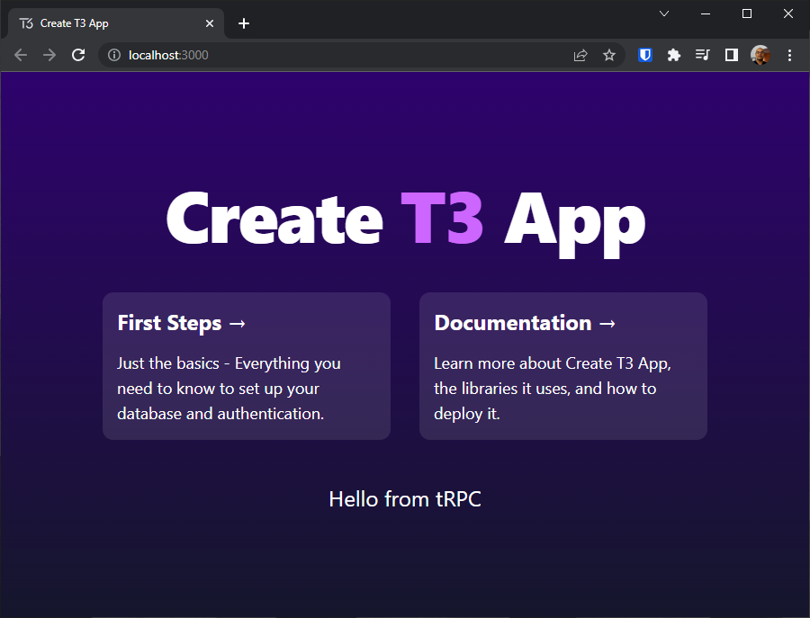

Use the `Ctrl + C` shortcut on your console to stop the NodeJS server.


## Uploading our code into GitHub
Now that we have a configured our T3 project it is a good time to commit our progress into GitHub. This will help us track all of our changes to the code from now on.

Let's start by navigating into your newly created T3 project through your console. In my case, it is `C:\git\birdy`, then type the following command to produce our first commit:
```text
git commit -m "App initial commit"
```

Then, open a browser tab, log into GitHub and create a new repository. In my case I named it **birdy** and made it private. We should not add a README file, nor add a .gitignore or a license at the moment, as the Create T3 app script already configured that for us.

Once the GitHub repo has been created, type the following commands into the console to let Git know that your remote repository is the one that you just created on GitHub.

```text
git remote add origin https://github.com/calderov/birdy.git
git branch -M main
git push -u origin main
```

If all of these succeeded, you should now see the changes reflected on GitHub.

## Database setup
Before we can deploy, we need a place to store our data. A great option for this is **Planetscale**, the world's most advanced serverless MySQL platform. Since this section can be a bit long let's split it in two steps:
1. Create a database.
2. Connect to the dabase.

### Create a Planetscale MySQL database
Let's start by opening [planetscale.com](https://planetscale.com) in a new tab and logging in through GitHub (you may need to confirm your email). Then, pick an organization name and follow the welcome caroussel until you reach the form to create your first database. In there, choose a name and a region for it, and click the **Create database** button. Your database should be ready in about a minute.
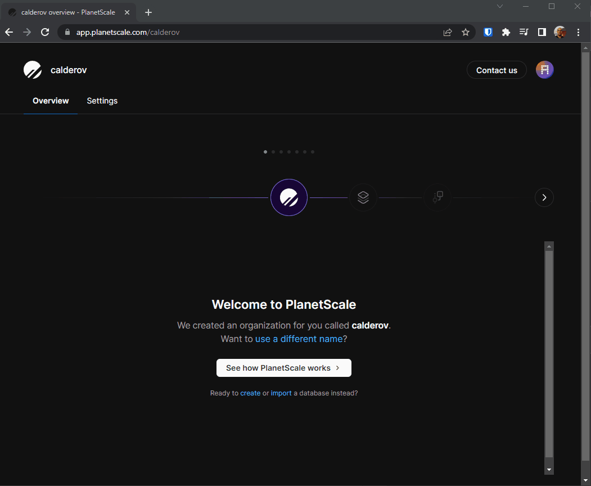

### Connect to our Planetscale database
Now that we have a database you should be presented with a database dashboard, click the **Get connection strings** button (look at the bottom of the example below).
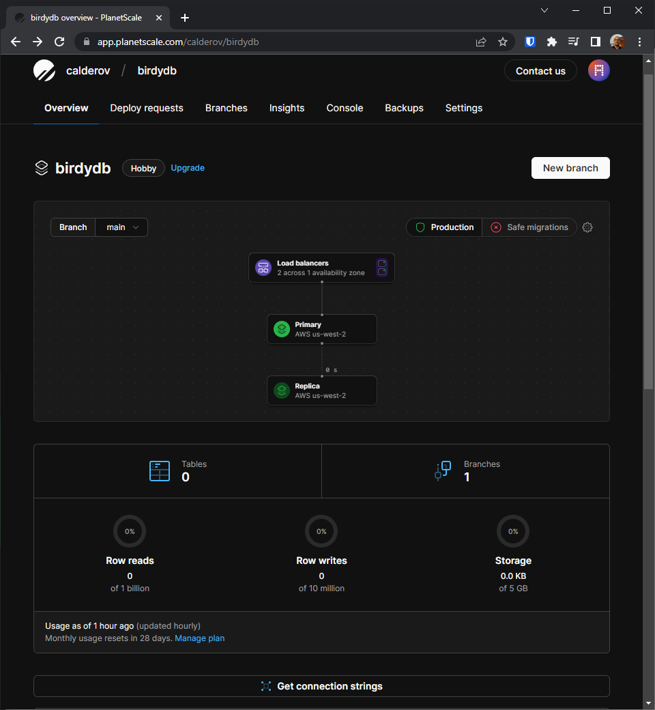

If this is the first time press this button, you will be asked to create a password for the database. In our example we picked the name **admin-password**, the **main** branch and the **Admin** role. Click **Create password** when you are finished to continue.
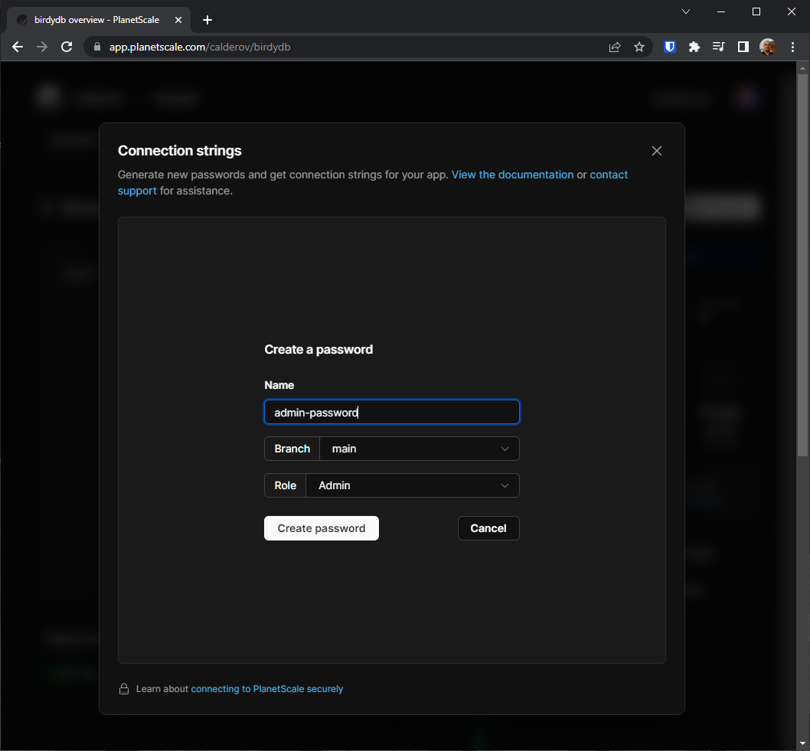

Once the password request has been processed, you will be presented with a form containing your database's connection strings. Make sure you copy and backup the **Username**, **Password** and contents of the **.env** file as they will not be persisted on Planetscale after you close the form. Also keep in mind these strings are sensitive information, so do not share them publicly
and store them in a safe place. You can close the **Connection strings** form now.
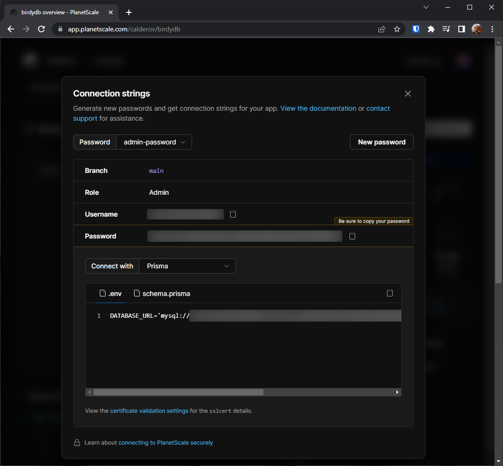

At this point, we got our database running and the necessary parameters to connect to it. Let's try "talking" to the database from our T3 project. 

Now, locate and open the **.env** file inside your T3 project and replace the line 
```text
DATABASE_URL="file:./db.sqlite"
```
with the contents of the **.env** file that you got from the **Connection strings** form on the previous section. It should look something like this:
```text
DATABASE_URL="mysql://<user>:<password>@aws.connect.psdb.cloud/<database>?sslaccept=strict"
```
This string is akin to a password to connect to Planetscale in your behalf from your local machine. Note that this will not be commited to GitHub as the **.env** file is listed in .gitignore. Regardless, handle it with care.

Next, open the **schema.prisma** file (`C:\git\birdy\prisma\schema.prisma` in our example) and edit the **generator client** and **datasource db** sections to look like this:
```text
generator client {
  provider = "prisma-client-js"
}

datasource db {
    provider = "mysql"
    url      = env("DATABASE_URL")
    relationMode = "prisma"
}
```
This will let Prisma set the schema of your database. Save your changes and type this command on the console to sync the schema changes to Planetscale.

```text
npx prisma db push
```

Awesome, now your local T3 environment can talk to your MySQL database in Planetscale. Let's put it to the test! 

Type the following command to open **Prisma Studio**, a handy tool to interact with your database from Prisma.
```text
npx prisma db push
```

This should open a browser window pointing to a local instance of **Prisma Studio** [(https://localhost:5555)](https://localhost:5555). Notice how the **Example** model is the only one listed at the moment, if you open it you will see how it matches with the schema definition at the bottom of the **schema.prisma** file; feel free to play a bit with this model in **Prisma Studio**, inserting and removing records to it.
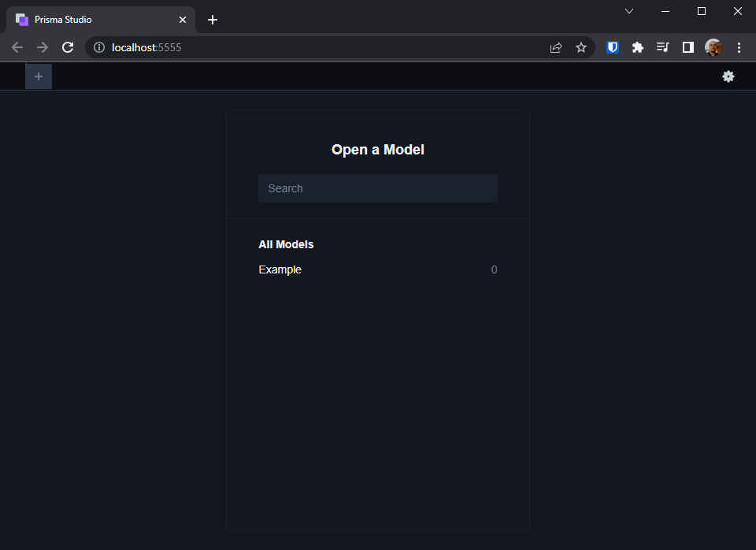
Go back to your console and press `Ctrl + C` to stop the **Prisma Studio** service.

Lets save our progress so far in our GitHub repo by pushing our changes into the repository by running these commands.

```text
git add prisma/schema.prisma
git commit -m "Configure Prisma to use MySQL"
git push
```

Now that your database is ready to serve your application. Let's move on and have it deployed.

## Initial Deployment
Now that our code is in GitHub, and our Planetscale MySQL database is ready, let's try to deploy this barebones app to the cloud. For this matter we will use Vercel, a unified cloud platform that allows devs to easily deploy, manage and scale web applications.

First, browse to [vercel.com](https://vercel.com) and sign in with your GitHub account. If this is your first time using Vercel you will be prompted with the **New Project Wizard**. Here, you can import a project from GitHub or start a new one using a template. 

Let's import our Git repository by clicking the **Select a Git Namespace** dropdown and picking the Add **GitHub Account**. 
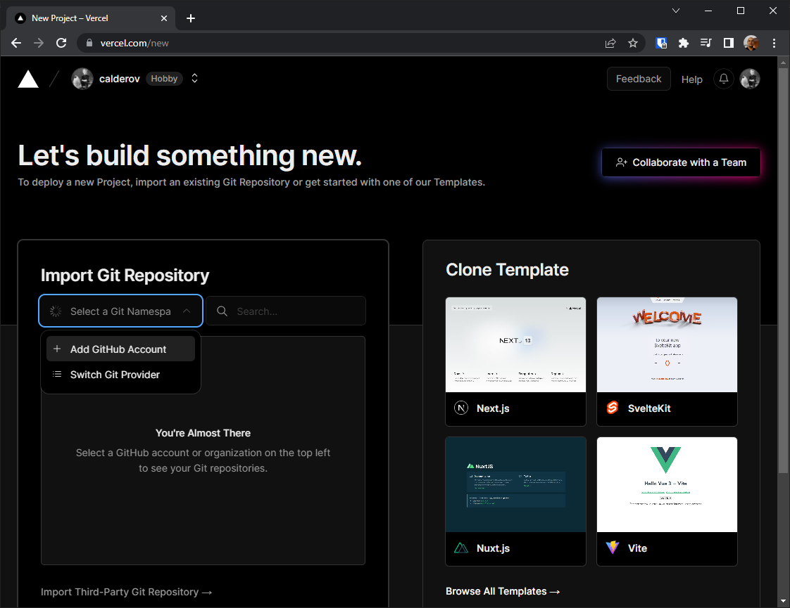

This will raise a pop up to give Vercel permission to read our GitHub repos. Select the repo that contains your T3 project click **Install**.
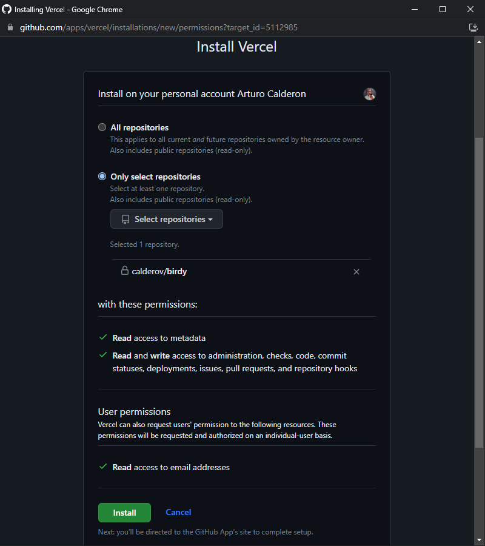

After Vercel finishes reading the contents of your repo it will be listed for import. Click the **Import** button on the form depicted below to proceed.
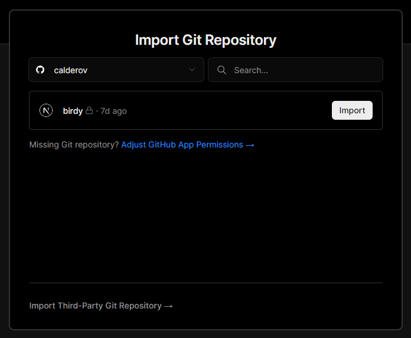

Now that your project is imported, you need to configure it to deploy correctly.
- First, expand the **Environment Variables** tab depicted in the **Configure Project** form.
- Then, copy and paste the **DATABASE_URL** value you got in your **.env** file (see the [previous section](#connect-to-our-planetscale-database))
- Click the **Add** button.
- Click the **Deploy** button.
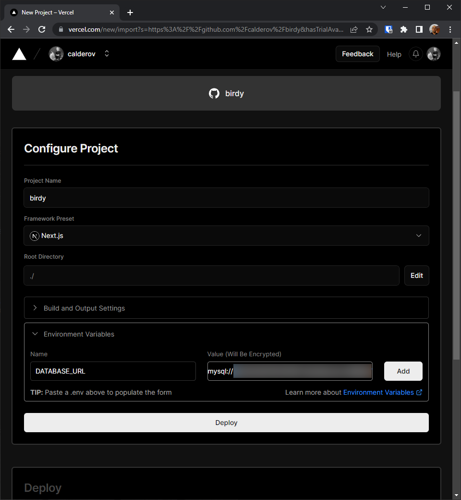

After a couple of minutes you will bee greeted with a successful deployment message!. Click on **Continue to Dashboard** to see more info.
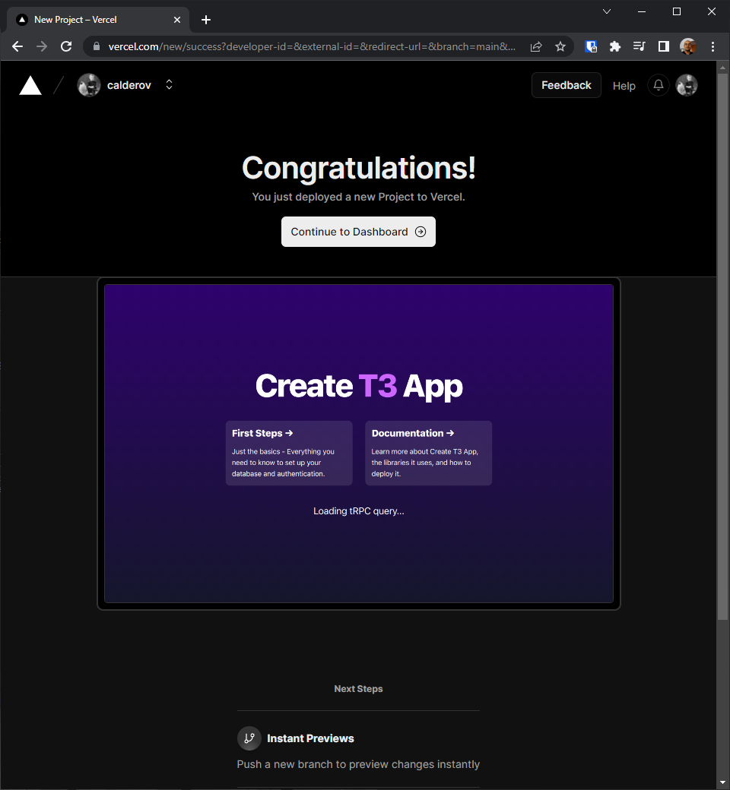

You have successfully deployed your app! As you can see in the dashboard, your app has been given a domain name that you can share with your users. Also, it shows that the **Production** deployment comes from the **main** branch on your Git repository, thus every time you push to that branch, a new deployment should happen automatically.
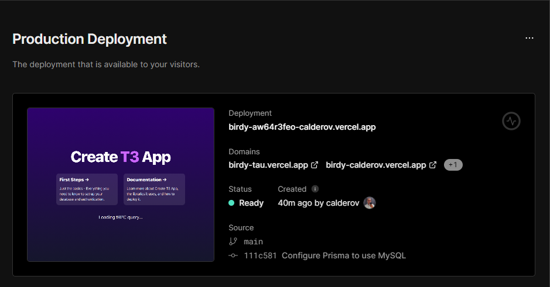

Finally, before we end this part of the tutorial, let's touch on one more thing. As you remember from our [database creation section](#create-a-planetscale-mysql-database) we picked a region for our MySQL database in Planetscale. Thus, it would nice if our app's code was hosted in the same region, right?. Let's see how can we get this configured in Vercel.

Find and click the **Settings** button in the top menu, then click on the **Functions** option. Select the region closest to that of your database and **Save** the changes. You are done, your app will move to that region the next time you deploy.
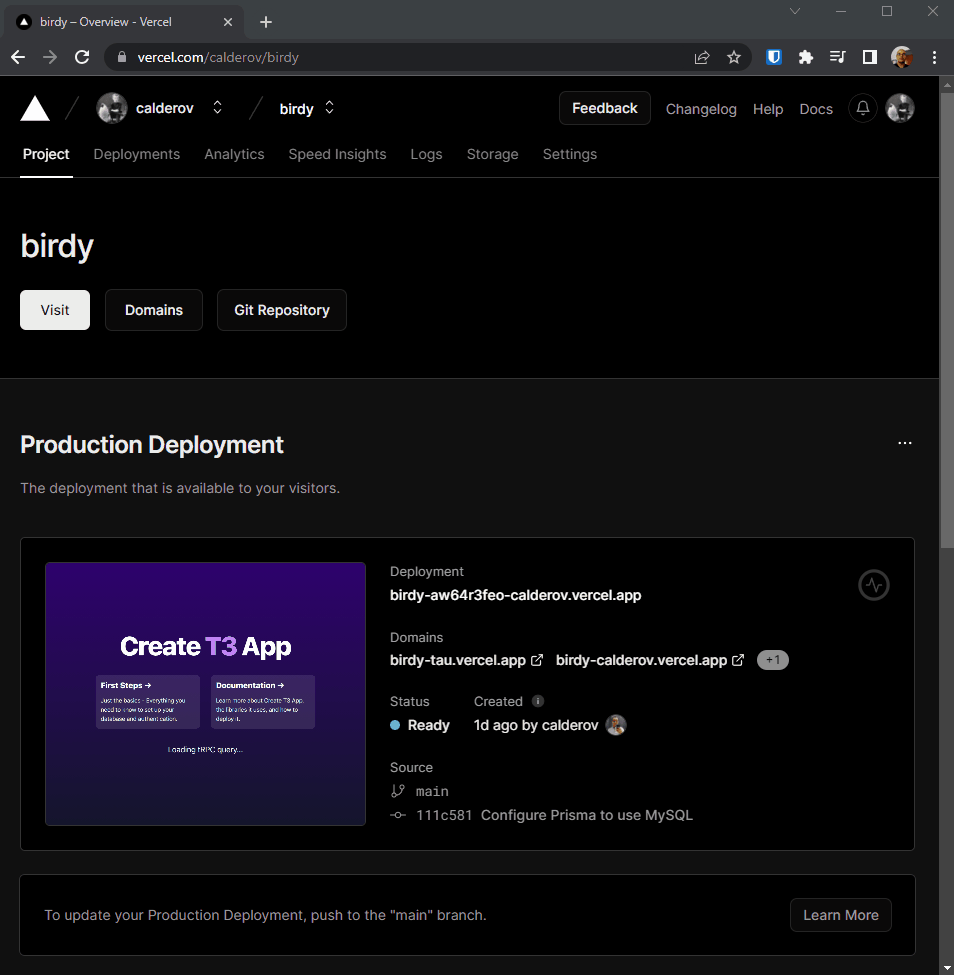

That's all for now. Thanks for reading this far. See you in [part two](../t3-tutorial-part-2) where we use Clerk to manage authentication.