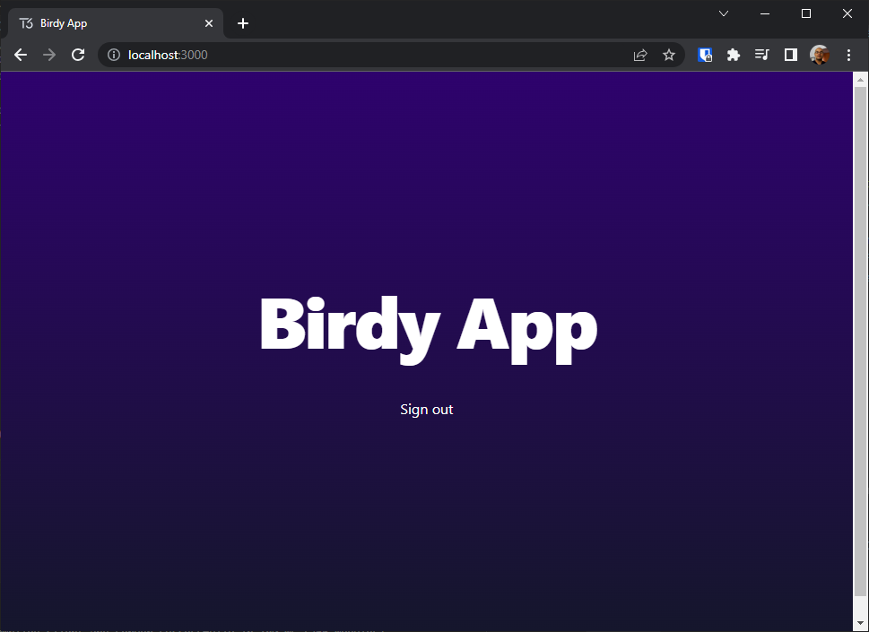

Welcome back to the Twitter clone tutorial with the T3 stack.

In [part one](../t3-tutorial-part-1) we saw how to setup our initial T3 application, we made a database to store our data, and we configured a pipeline to deploy it everytime we pushed changes to the main branch of our GitHub repo.

Now, we are going to learn how to enforce authentication within our app. That means, how do users subscribe and log-in into it. For this purpose, we will use [Clerk](https://clerk.com) a user management tool for NextJS.

## Prerequisites
Please make sure you've completed the steps in [part one](../t3-tutorial-part-1) before continuing. The following steps assume that you have a working project set up as we explained earlier, and that you're familiar with the concepts we discussed in that section.

## What about NextAuth?
Altought, [NextAuth.js](https://next-auth.js.org/) is often used as part of the T3 stack, [Clerk](https://clerk.com) is a valid replacement.

Clerk is considered easier than NextAuth as it provides a pre-built user interface and can be configured within minutes. However, it is a paid service, but in most situations we can get away with its generous free tier.

Thus, we'll use Clerk for this tutorial to make it easier for the reader.

## Setting up a Clerk account
Let's start by setting up a Clerk account. First, open your browser and go to [clerk.com](https://clerk.com). Then click the **Start building for free** button on the landing page to sign up for the service. Choose your preferred sign in method (I personally use GitHub), authorize Clerk to read your credentials and wait until you are redirected to the Clerk dashboard. 


## Registering our app in Clerk
On the Clerk dashboard, click the **Add application** button. This will prompt a form to configure a new application to work with Clerk.

Give, your application a name and select how will your users sign in and click the **Create Application** button.

For our example we named our application **Birdy** and picked **Google** and **GitHub** as valid authentication methods.


Once your application has been registered, you will be presented with a bunch of options to integrate Clerk with your framework of choice. Since we are using NextJS, we will pick it from the selection and copy the API keys into the **.env** file within our project.


We also need to provide these API keys to our app in [Vercel](https://vercel.com) so it knows how to talk to Clerk. Thus, open [vercel.com](https://vercel.com) in your browser, pick your project from the dashboard (**birdy** in our example) and click on the **Settings** option on the top menu. Then, click on **Environment Variables** and paste the API keys you copied from Clerk. Finally, click **Save**.


Excellent, now your local and cloud applications have the keys they need to interact with Clerk. 

## Integrating Clerk with our app
Let's integrate Clerk with our app, so we get to see a sign in form whenever we try to access to it.

First, open a console and point it to the directory where your T3 project lives (`C:\git\birdy` in our example). Then, type the following command to install the Clerk components in our app. 
```text
npm install @clerk/nextjs
```

When the command is finished, open the **_app.tsx** file in your project and change its contents to look like this:
```typescript
import { ClerkProvider } from "@clerk/nextjs";
import { type AppType } from "next/app";
import { api } from "~/utils/api";
import "~/styles/globals.css";

const MyApp: AppType = ({ Component, pageProps }) => {
  return (
    <ClerkProvider {...pageProps}>
      <Component {...pageProps} />;
    </ClerkProvider>
    );
};

export default api.withTRPC(MyApp);
```
\* `C:\git\birdy\src\pages\_app.tsx` in our example.

Note how we import the `ClerkProvider` component from the Clerk library and how we are using it to wrap around the main component of our app. This means, that the Clerk UI will supersede our own UI and only make it reachable if the user is authenticated.

Next, let's decide which pages in our app should be public and which need to hide behind authentication. We do this by creating a **middleware.ts** file inside the **src/** folder with the following contents:
```typescript
import { authMiddleware } from "@clerk/nextjs";

export default authMiddleware();

export const config = {
  matcher: ["/((?!.*\\..*|_next).*)", "/", "/(api|trpc)(.*)"],
};
```
This will make your entire application protected, and if you try to access it, it will redirect you to the sign up page.

Let's put this to the test by running your app localy by typing this command on the console.
```text
npm run dev
```
Then, open your browser and navigate to [https://localhost:3000](https://localhost:3000) to open your app. You should see Clerk's log-in UX. Go ahead and try signing in!


## Adding a Sign Out button
Now that our users can log into our app, lets give them a way to log out. 

Open the **index.tsx** file (`C:\git\birdy\src\pages\index.tsx` in our example) and add this line to the top of the file.
```typescript
import { SignOutButton } from "@clerk/nextjs";
```
Then, paste these lines at the bottom of the page just before closing the last `div` inside the `main` section. 
```typescript
<div className="text-white">
    <SignOutButton/>
</div>
```

This is how it looks in Visual Studio.


Save your changes and reload the app's page in the browser. This should have put the **Sign off** button a the bottom of the page. Go ahead and click it to verify it does log you off.


You can now close your app's local instance now by pressing `Ctrl + C` on the console where it is running, and save your changes to the repo with the following commands.
```text
git add -A
git commit -m "Add authentication through Clerk"
git push
```

## Managing users
Congratulations, you've successfully added authentication to your app. You can manage your users using [Clerk dashboard](https://dashboard.clerk.com/). Feel free to play with it and try to learn how to list, remove and ban users with it.


That's all for now. Thanks for reading this far. See you soon in part three!.